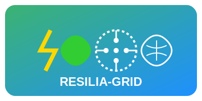

# Concept RESILIA-GRID 

## Réseau Énergétique Synergétique Intelligent et Localisé Intégrant l'IA pour un Avenir Résilient et Décarboné

## 💡 Vision et mission

RESILIA-GRID imagine un futur où les systèmes énergétiques sont:

- **Décentralisés** plutôt que centralisés
- **Collaboratifs** plutôt qu'autoritaires
- **Intelligents** plutôt que réactifs
- **Résilients** plutôt que vulnérables
- **Verts** plutôt que polluants

Notre mission est de créer un écosystème énergétique où chaque quartier, ville et région peut atteindre l'autonomie énergétique tout en restant interconnecté, permettant ainsi une résilience locale face aux crises tout en optimisant collectivement l'efficacité globale.

## 🌟 Innovation de rupture

RESILIA-GRID ne se contente pas d'améliorer le système existant - il le repense entièrement. Voici les aspects véritablement révolutionnaires du projet:

### 1️⃣ L'IA "NeuroGrid" holistique et décentralisée

Contrairement aux systèmes d'IA centralisés, NeuroGrid fonctionne comme un réseau neuronal distribué où chaque microgrid dispose de sa propre intelligence locale qui collabore avec les autres. Cette approche permet:

- Une adaptation hyperlocale aux conditions météorologiques spécifiques
- Une prise de décision autonome même en cas de déconnexion du réseau principal
- Une amélioration continue par apprentissage fédéré sans centraliser les données sensibles
- Une optimisation multi-objectifs (économie, écologie, résilience) plutôt que mono-objectif

### 2️⃣ Approche multicouche du stockage énergétique

RESILIA-GRID abandonne la recherche d'une "solution unique" au stockage pour adopter une stratégie multiniveau:

- **Court terme** (secondes-heures): Batteries à électrolyte solide pour stabilisation de fréquence
- **Moyen terme** (heures-jours): Stockage thermique (sel fondu/sable) pour les besoins industriels
- **Long terme** (jours-saisons): Hydrogène vert pour pallier les variations saisonnières
- **Véhicules électriques** comme ressources de stockage mobiles et distribuées (V2G)

L'IA orchestrant ces différents modes de stockage selon leur efficacité, coût, et pertinence contextuelle.

### 3️⃣ "EnerShare" - Marché P2P de l'énergie basé sur la blockchain

EnerShare transforme les consommateurs passifs en acteurs du marché énergétique:

- Échange direct de l'énergie entre voisins sans intermédiaires
- Tarification dynamique reflétant la disponibilité réelle et le contenu carbone
- Mécanismes de réputation et de gamification pour encourager les comportements vertueux
- Certification blockchain de l'origine de l'énergie avec traçabilité transparente

### 4️⃣ Intégration syntropique avec l'environnement

Plutôt que de simplement minimiser l'impact environnemental, RESILIA-GRID cherche à créer des synergies positives:

- Panneaux solaires intégrés au bâti qui améliorent l'isolation thermique
- Éoliennes verticales fixées sur infrastructures existantes (pylônes, toits)
- Production de biogaz à partir de déchets organiques locaux
- Récupération de chaleur fatale industrielle pour chauffage urbain

## 🔄 Circularité et résilience

RESILIA-GRID est conçu selon les principes de l'économie circulaire et de l'anti-fragilité:

### Circularité matérielle
- Conception modulaire permettant réparation et mise à niveau
- Matériaux recyclables ou biosourcés pour tous les composants
- Partenariats avec filières de recyclage pour fin de vie

### Circularité énergétique
- Boucles locales production-stockage-consommation
- Valorisation des surplus sous différentes formes (électricité, chaleur, hydrogène)
- Cascades d'usages énergétiques (ex: chaleur résiduelle après production électrique)

### Résilience multidimensionnelle
- Autonomie possible à chaque échelle (bâtiment, quartier, ville)
- Redondance des systèmes critiques
- Capacité d'îlotage en cas de cyberattaque ou défaillance majeure
- Restauration automatique après perturbation

## 📈 Modèle économique innovant

RESILIA-GRID repose sur un modèle hybride combinant:

- **Investissement public-privé** pour les infrastructures stratégiques
- **Coopératives énergétiques citoyennes** pour l'appropriation locale
- **Service d'optimisation par abonnement** pour le logiciel NeuroGrid
- **Micro-transactions** sur la plateforme EnerShare
- **Valorisation des services écosystémiques** (stabilité réseau, réduction carbone)

Ce modèle permet un déploiement progressif et adaptatif, avec différentes options selon les contextes locaux.

## 🌱 Impact et perspectives

À terme, RESILIA-GRID vise à transformer radicalement notre rapport à l'énergie:

- **Environnemental**: Réduction de 90% des émissions CO2 du secteur électrique
- **Social**: Démocratisation de l'accès à l'énergie et participation citoyenne
- **Économique**: Création d'emplois locaux non-délocalisables et réduction des coûts
- **Résilience**: Capacité d'adaptation aux chocs climatiques, économiques ou cybernétiques

Le projet entend devenir un standard ouvert pour les territoires du monde entier, offrant une alternative crédible aux systèmes énergétiques centralisés du 20ème siècle.

## ✨ En résumé

RESILIA-GRID représente une vision holistique où technologie de pointe et conscience écologique convergent pour créer un système énergétique véritablement adapté aux défis du 21ème siècle - un système qui place l'humain et la planète au cœur de l'innovation.