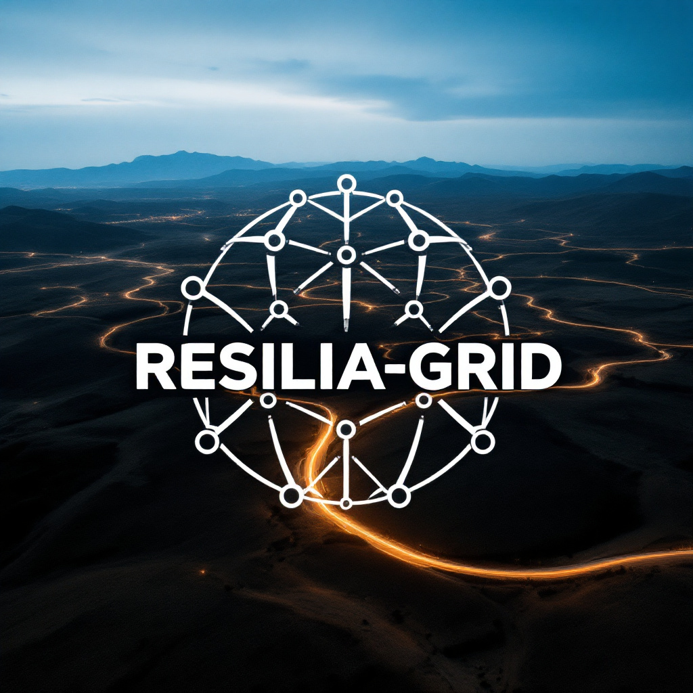

# RESILIA-GRID 🌿⚡

**Réseau Énergétique Synergétique Intelligent et Localisé Intégrant l'IA pour un Avenir Résilient et Décarboné**

RESILIA-GRID n'est pas qu'un projet technologique : c'est un écosystème qui place l'humain et la planète au cœur de l'innovation. En combinant IA et énergies vertes, il offre une feuille de route crédible pour un avenir résilient.

## Table des matières
- [Contexte et Objectifs](#contexte-et-objectifs)
- [Composants Clés du Projet](#composants-clés-du-projet)
- [Phases de Développement](#phases-de-développement)
- [Partners Clés et Financement](#partners-clés-et-financement)
- [Indicateurs de Succès](#indicateurs-de-succès)
- [Défis et Solutions](#défis-et-solutions)
- [Documentation](#documentation)
- [Contribuer](#contribuer)
- [License](#license)

## Contexte et Objectifs 🌍

Face aux défis climatiques, à la volatilité des énergies fossiles et à la nécessité de résilience face aux crises (climatiques, cyberattaques, etc.), RESILIA-GRID propose un système énergétique décentralisé, autonome et 100 % renouvelable, piloté par une IA holistique. Ce projet vise à :

- **Décarboner** 🌱 la production et la consommation d'électricité
- **Renforcer la résilience** 🛡️ via des microgrids locaux capables de fonctionner en autonomie
- **Optimiser l'efficacité énergétique** 📊 grâce à l'IA, en intégrant production, stockage et consommation

## Composants Clés du Projet

### 1. Production Énergétique Hybride et Décentralisée ☀️🌬️

**Mix Renouvelable Innovant :**
- Énergies classiques (solaire, éolien, hydroélectricité)
- Solutions émergentes (énergie osmotique, biogaz à partir de déchets organiques, géothermie de surface)
- Réutilisation d'infrastructures existantes (ex: pylônes électriques équipés de turbines éoliennes à axe vertical)

**Matériaux Durables :**
- Panneaux solaires à pérovskite (efficacité >30%)
- Éoliennes en matériaux recyclables

### 2. Stockage Énergétique Intelligent 🔋

**Multicouches et Adaptatif :**
- Batteries à électrolyte solide (haute densité, sécurité)
- Hydrogène vert produit pendant les surplus d'énergie
- Stockage thermique (sel fondu ou sable) pour les industries

**Gestion Dynamique par IA :**
- L'IA priorise le mode de stockage en fonction des prévisions météo, de la demande et de la durabilité

### 3. IA Holistique "NeuroGrid" 🧠

**Fonctionnalités Principales :**
- **Prédiction Hyperlocale :** 🔮 Modèles météo à haute résolution couplés à des données satellitaires
- **Équilibrage en Temps Réel :** ⚖️ Répartition intelligente de l'énergie entre microgrids, stockage et consommateurs
- **Autocorrection :** 🔧 Détection et réparation de pannes via des drones autonomes et des capteurs IoT
- **Optimisation Collective :** 📈 Apprentissage fédéré pour améliorer les algorithmes sans centraliser les données

### 4. Réseau Résilient et Modularisable 🔄

**Microgrids Autonomes :**
- Chaque quartier/ville dispose de son microgrid, interconnectable mais capable de fonctionner en îlot
- **Backup Énergétique :** 🚗 Batteries de véhicules électriques (V2G) et générateurs à hydrogène
- **Cybersécurité renforcée :** 🔒 Blockchain pour transactions énergétiques et IA dédiée à la détection d'intrusions

### 5. Consommation Collaborative 👥

**Plateforme P2P "EnerShare" :**
- Échange de surplus énergétique via une application pilotée par l'IA
- **Gamification :** 🎮 Récompenses (NFT verts, crédits carbone) pour réduction d'empreinte
- **Industries responsables :** ⏰ Plages horaires optimales pour utilisation d'énergie bas carbone

## Phases de Développement 📅

### Prototypage (2025-2027) 🧪
- Déploiement de microgrids tests dans des zones isolées (îles, montagnes)
- Entraînement de NeuroGrid sur des données hybrides (réelles et simulées)

### Scale-up Urbain (2028-2030) 🏙️
- Intégration dans des villes pilotes (ex: Bordeaux, Lyon)
- Déploiement massif de stockage hydrogène

### Globalisation (2031+) 🌐
- Standardisation des modules RESILIA-GRID pour l'export
- Partnerships avec les pays en développement

## Partners Clés et Financement 🤝

- **Public :** 🏛️ ADEME, Union Européenne (fonds Green Deal)
- **Privé :** 🏢 Startups de la GreenTech, fabricants de batteries (Northvolt), géants de l'IA (DeepMind)
- **Citoyens :** 👪 Crowdfunding et coopératives énergétiques

## Indicateurs de Succès 📊

- **Environnementaux :** 🌱 Réduction de 90% des émissions CO2 liées à l'électricité d'ici 2040
- **Résilience :** 💪 99,99% de disponibilité énergétique même en scénarios extrêmes
- **Économiques :** 💰 Coût du kWh divisé par 2 grâce à l'optimisation IA

## Défis et Solutions ⚠️

- **Défi Régulatoire :** 📜 Lobbying pour adapter les lois sur l'autoconsommation et l'hydrogène
- **Acceptation Sociale :** 🗣️ Campagnes de sensibilisation avec influenceurs et écoles
- **Coût Initial :** 💸 Subventions et prêts à taux zéro pour les collectivités

## Documentation 📚

Consultez notre [documentation complète](docs/README.md) pour plus de détails sur l'architecture, les spécifications techniques et les guides d'implémentation.

## Contribuer 👐

Nous accueillons toute contribution! Consultez notre [guide de contribution](CONTRIBUTING.md) pour en savoir plus sur comment vous pouvez participer au projet.

## License 📄

Ce projet est sous licence [MIT](LICENSE).
