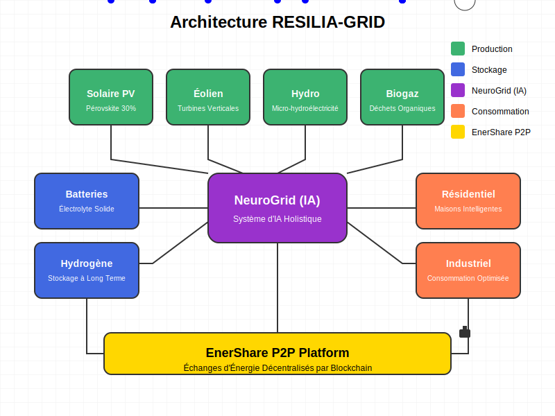

# 📚 Documentation RESILIA-GRID

Bienvenue dans la documentation technique du projet RESILIA-GRID. Cette documentation vise à fournir toutes les informations nécessaires pour comprendre, implémenter et contribuer au projet.

## Table des matières

- [Vue d'ensemble](#vue-densemble)
- [Architecture](#architecture)
- [Composants du système](#composants-du-système)
- [Guides d'implémentation](#guides-dimplémentation)
- [API Reference](#api-reference)
- [FAQ](#faq)

## 🔍 Vue d'ensemble

RESILIA-GRID est un système énergétique décentralisé combinant énergies renouvelables et intelligence artificielle pour créer un réseau résilient et décarboné. Le projet s'articule autour de cinq piliers fondamentaux:

1. Production d'énergie hybride et décentralisée ☀️🌬️
2. Stockage énergétique multicouche 🔋
3. IA holistique "NeuroGrid" 🧠
4. Microgrids résilients 🔄
5. Plateforme collaborative de consommation "EnerShare" 👥

## 🏗️ Architecture

L'architecture de RESILIA-GRID repose sur une approche modulaire permettant l'évolutivité et l'adaptabilité du système. Elle est structurée en plusieurs couches:

- **Couche Physique**: Production et stockage d'énergie, capteurs IoT, drones de maintenance
- **Couche Réseau**: Infrastructure de communication sécurisée entre les composants
- **Couche Données**: Collecte, traitement et stockage des données énergétiques et météorologiques
- **Couche IA**: Algorithmes d'optimisation, prédiction et équilibrage
- **Couche Application**: Interfaces utilisateur et APIs pour l'interaction avec le système

Pour des détails spécifiques sur chaque composant, consultez les documents dédiés:

- [Architecture détaillée](architecture/architecture-details.md)
- [Diagrammes de flux](architecture/flow-diagrams.md)
- [Mécanismes de sécurité](architecture/security-mechanisms.md)

## ⚙️ Composants du système

### 🌞 Production Énergétique
- [Spécifications des panneaux solaires à pérovskite](components/perovskite-solar-specs.md)
- [Intégration des turbines éoliennes à axe vertical](components/vertical-axis-turbines.md)
- [Solutions de micro-hydroélectricité](components/micro-hydro.md)

### 🔋 Stockage Énergétique
- [Batteries à électrolyte solide](components/solid-electrolyte-batteries.md)
- [Système de production et stockage d'hydrogène vert](components/green-hydrogen.md)
- [Stockage thermique pour applications industrielles](components/thermal-storage.md)

### 🧠 NeuroGrid (IA)
- [Architecture de l'IA holistique](neurogrid/architecture.md)
- [Modèles de prédiction météorologique](neurogrid/weather-prediction.md)
- [Algorithmes d'équilibrage énergétique](neurogrid/energy-balancing.md)
- [Système d'apprentissage fédéré](neurogrid/federated-learning.md)

### 🔗 Microgrids
- [Conception des microgrids autonomes](microgrids/autonomous-design.md)
- [Protocoles d'interconnexion](microgrids/interconnection-protocols.md)
- [Mécanismes de résilience](microgrids/resilience-mechanisms.md)

### 👥 EnerShare
- [Plateforme d'échange P2P](enershare/p2p-platform.md)
- [Système de tarification dynamique](enershare/dynamic-pricing.md)
- [Mécanismes de gamification](enershare/gamification.md)

## 🛠️ Guides d'implémentation

- [Guide d'installation](implementation/installation-guide.md)
- [Configuration initiale](implementation/initial-setup.md)
- [Déploiement en zone urbaine](implementation/urban-deployment.md)
- [Déploiement en zone isolée](implementation/remote-deployment.md)
- [Maintenance et mise à jour](implementation/maintenance.md)

## 🔌 API Reference

RESILIA-GRID expose plusieurs APIs pour l'intégration avec d'autres systèmes:

- [API Production](api/production-api.md)
- [API Stockage](api/storage-api.md)
- [API Prédiction](api/prediction-api.md)
- [API EnerShare](api/enershare-api.md)

## ❓ FAQ

Consultez notre [Foire Aux Questions](faq.md) pour des réponses aux questions fréquemment posées sur RESILIA-GRID.

---

**Note**: Cette documentation est en constante évolution. N'hésitez pas à contribuer en soumettant des pull requests ou en signalant des problèmes via les issues GitHub.
